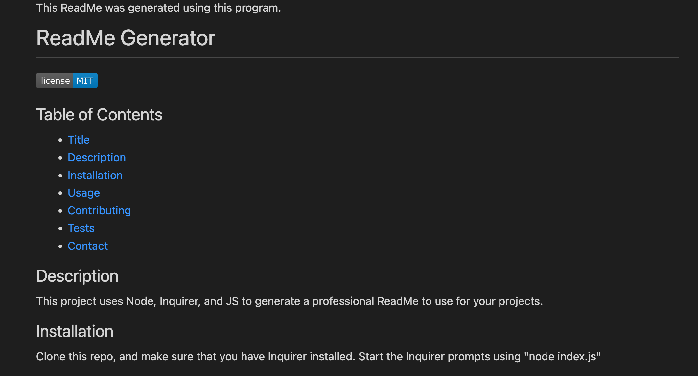

This ReadMe was generated using this program.

# ReadMe Generator
        
        

      

## Table of Contents

* [Title](#title)
* [Description](#description)
* [Installation](#installation)
* [Usage](#usage)
* [Contributing](#contributing)
* [Tests](#tests)
* [Contact](#contact)

## Description

This project uses Node, Inquirer, and JS to generate a professional ReadMe to use for your projects. 

## Installation

Clone this repo, and make sure that you have Inquirer installed. Start the Inquirer prompts using "node index.js"

## Usage

This project will simplify ReadMe generation, and help you to remember what should be in a professional ReadMe file. 

## [License](#license)
The application is covered under the following license:

[MIT](https://choosealicense.com/licenses/MIT)
  
  

## Contributing

Emily Stewart Kukwa

## Tests

## Contact

If you have any questions, please contact me using the following links:

[GitHub](https://github.com/easmsm)

Email: easmsm@gmail.com

## Links and Screen Shot

Link to walk through video:

[Video](https://watch.screencastify.com/v/MMoSiWEncmacKkochlJT)

